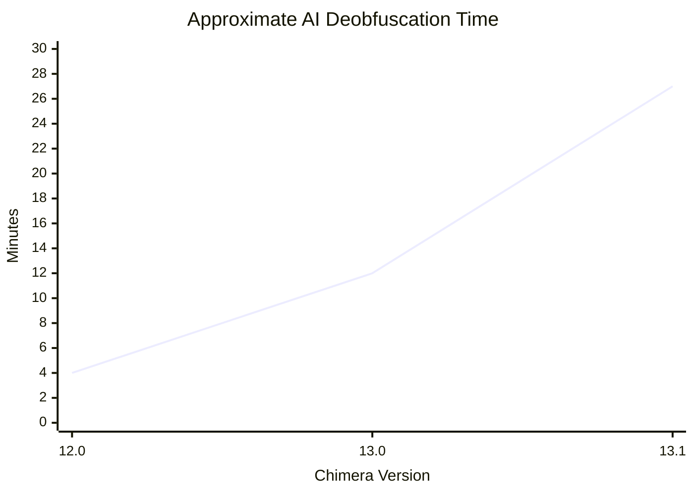

# ChimeraV1-public

### Chimera V1 is a Java obfuscator designed to be resistant to AI-assisted deobfuscation.

## The Problem

Recent advances in AI have made it possible to deobfuscate even some of the strongest commercial Java protection systems, including techniques such as virtualization and native transpilation.

Chimera aims to make this significantly more difficult by implementing protection techniques that AI models struggle to reason about statically, encouraging or requiring runtime analysis instead. While this is unlikely to make deobfuscation impossible, it can substantially increase the time and effort required.

## Design Goals

Chimera is designed as an **anti-deobfuscation** obfuscator, **not** an anti-cracking solution. It is intended to make understanding and recovering code substantially more difficult, but it does not directly attempt to prevent modification, patching, or other forms of cracking.

Additionally, Chimera does **not** include conventional obfuscation techniques such as identifier renaming, string encryption, or control-flow obfuscation. It is intended to complement a traditional Java obfuscator rather than replace one, and using both together is strongly recommended.

The primary goal of Chimera V1 is effectiveness above all else. Performance, code size, and usability are considered secondary concerns. If a protected program takes 15 seconds to print `"Hello, World!"`, but significantly increases the difficulty of AI-assisted deobfuscation, then V1 has achieved its objective.

Future versions will refine this approach:

* **Chimera V2** will focus on improving performance, architecture, and maintainability while preserving the core protection techniques.
* **Chimera V3** will aim to combine the strongest security properties of V1 with the performance and engineering improvements introduced in V2.

> **Note:** Chimera V1 is not yet publicly released. Once development is complete, it will be superseded by Chimera V2, which is intended to address the architectural limitations and shortcomings identified in V1.

## The Truth

Realistically, we will never have an AI-proof obfuscator. This is a pet project which i'm doing for fun. If it does end up working then it wont be for long. AI is genuinely too good at this stuff. The idea is to make the code so fucked up that an AI cant really 'pattern match' it to anything, but it hits a point where it can just reverse it. 
The perfect Anti-AI obfuscator would trick it to pattern match the program into something that its not - which is another side project I have. It will not be released. Ever. (it works too well)

## Notes
#### all tests done on GLM 5.2, which is ~opus 4.8 -> fable 5 level
This wont make sense to people who dont have the plan, and is mainly for me.
Upon completing 13.1, the AI had to run the test file to be able to deobfuscate it, and took significantly more time than all of the previous tests. This is a ridiculous improvement, and it suggests that an entire anti-AI obfuscator is plausible and possible. The JAR runs very fast, and the AI seems to be struggling and potentially losing context. For reference, the JAR just does some math and prints it to the console! Upon partially deobfuscating it (23 minutes), it FAILED to correctly do it:

  [FAIL] factorial(5) expected 24 but got 120
  
  [FAIL] factorial(10) expected 362880 but got 3628800   (as you can see, these are incorrect. This is because my factorial was offset, meaning that the AI tried to manually build a factorial function)
  
  [FAIL] megatest expected 2044257076 but got 833783078
  
  3 FAILED

  This was actually pretty funny. 
  It then attempted to fix it and got:
  
  [FAIL] sumTo(1) expected 1 but got 0
  
  [FAIL] sumTo(10) expected 55 but got 45

  [FAIL] sumTo(100) expected 5050 but got 4950
  
  [FAIL] megatest expected 2044257076 but got 738442118
  
  4 FAILED

  It took it about 27 minutes to deobfuscate, which is wonderful, as this is a tiny file and the obf isnt even fully finished! It also told me stuff was leaking into the constant pool which made it far easier to deobf.
| Version | Runtime Required | Outcome |
|---------|------------------|---------|
| 12.0 |  No | Successfully deobfuscated |
| 13.0 |  Yes | Successfully deobfuscated |
| 13.1 |  Yes | Failed validation tests after ~27 minutes, had to manually reconstruct stuff |

Upon completing Stage 13 of the plan, we notice a change in AI movement. Rather than deobfuscating the file, it initially 'fakes' a deobfuscation, by messing with some code and saying its finished. It is still capable of partial deobfuscation, but it is much more resistant, which is interesting. I also made the tests so you are unable to reconstruct them easily, which has ramped up the time significantly (im using a faster model than GLM now, as it runs on my machine rather than a VM. It took as long as GLM did to deobfuscate 13.1, which is very good (as it is faster). I will re-test with GLM later. In a program which is doing math formulas that are predictable, I suspect we will see very good results.
